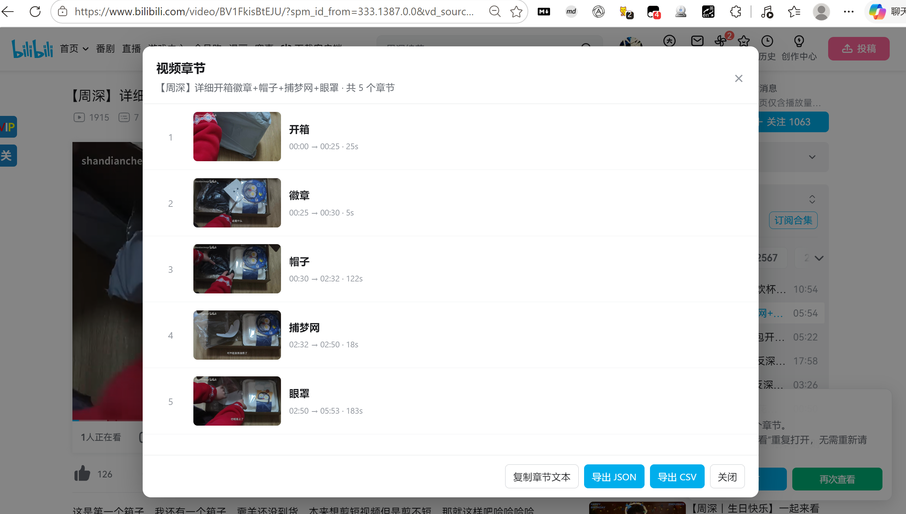

[English] / [中文版](./README.md)

# Bilibili Uploads and Video Chapters Exporter

A single-file userscript for exporting public uploads and video chapters to JSON / CSV.

## Features

- Identify the UP owner's UID from their space URL; fetch paginated public uploads with WBI signing and deduplicate results.
- Preview before downloading. Filter by collection status, search titles, and select individual videos.
- Videos without a reported collection are selected by default.
- Reopen the selection dialog using cached data without fetching again.
- On BV video pages, copy chapter timestamps/titles or export JSON / CSV for the current part.

## Install

Install Tampermonkey or Violentmonkey, then [install the userscript](https://raw.githubusercontent.com/shandianchengzi/bilibili-analyze/main/bilibili_space_video_exporter.user.js). Sign in to Bilibili and open a space or BV video page.

Greasy Fork URL: pending author publication.
CSDN article URL: pending author publication. See [the prepared article](./docs/CSDN.md).

## Usage

On `https://space.bilibili.com/<UID>/upload/video`, click 获取投稿列表 (fetch uploads), select videos, then 导出已选视频 (export selected). JSON and CSV are downloaded together. 选择并导出 (select and export) reuses the current in-memory list; a refresh discards it.

Changing the filter does not clear selections outside that filter. Check the selected count before exporting.

On `https://www.bilibili.com/video/<BVID>?p=N`, click 获取章节 (fetch chapters). Copy timestamp/title text or export JSON / CSV. 再次查看 (view again) reopens cached chapters. Change parts and fetch again.

## Screenshots

Screenshots captured by the author while using the script on Bilibili, showing upload selection and video chapter export.

## Limits and privacy

Only publicly accessible uploads returned by Bilibili are available. Missing API fields remain empty; collection classification depends on returned season metadata. Chapter extraction reads `view_points`, and does not generate chapters from audio or subtitles.

Requests reuse your browser login session. The script does not upload cookies or exported data to the author. CryptoJS is loaded from cdnjs; preview images use URLs returned by Bilibili. Images and videos themselves are not downloaded.

Pagination waits 650 ms. Stop and retry later on risk-control errors. Do not navigate to another owner while fetching. Browser, API, CORS or extension changes may affect operation.

## Development

The `.user.js` file is the sole publishable source; no build step. See [publishing and validation](./PUBLISHING.md). The demo runner verifies UI behavior with intercepted API fixtures; it does not verify live Bilibili access or userscript-manager installation.

## License

[MIT](./LICENSE).
